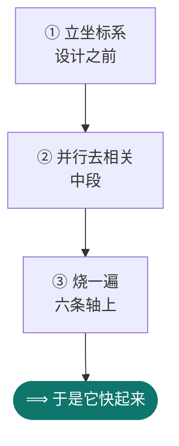
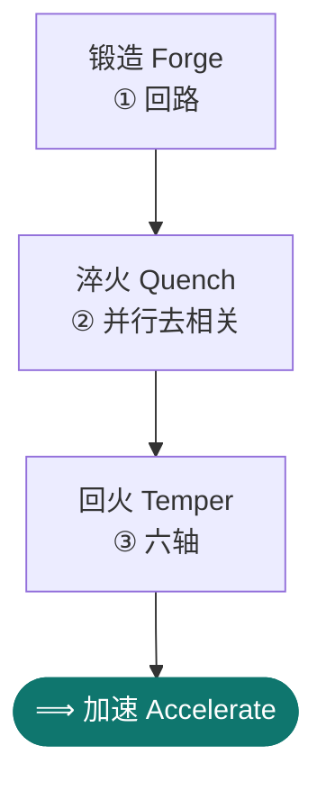

<p align="center">
  
</p>

<p align="center">
  <a href="https://github.com/walkinglabs/awesome-harness-engineering#coding-agent-harnesses"></a>
  <a href="https://github.com/VoltAgent/awesome-agent-skills#community-skills"></a>
  
  <a href="https://www.npmjs.com/package/@chrono-meta/fh-gate"></a>
  <a href="https://github.com/chrono-meta/homebrew-forge-harness"></a>
  <a href="LICENSE"></a>
</p>

<p align="center">
  <a href="README.md">English</a> · <a href="README.ko.md">한국어</a> · <b>中文</b> · <a href="README.ja.md">日本語</a>
</p>

<p align="center">
  <b>别再一遍遍向 agent 解释规则 — 把它们放进项目里。</b>
</p>

<p align="center">
  <b>抓住的不只是你的 agent，还有你——的质量门禁。</b>
</p>

<p align="center">
  
</p>
<p align="center">
  <sub>这是真实运行，不是演示。一个 agent“整理”技能定义文件（<code>SKILL.md</code>）时删掉了 <b>Done When（完成条件）</b>小节。门禁会点名指出被删的小节；把它放回去，其余整理照常通过。<br>重新生成：<code>brew install vhs &amp;&amp; vhs docs/demo/gate-block.tape</code></sub>
</p>

<p align="center">
  你大概已经在对 Claude Code 反复说同样的话：要跑的检查、要守的规则、一次变更该有的样子。
  变得可复用的正是这一部分，而它刻意保持通用的形态，好在使用过程中按你的场景当场锻造。<br>
  <sub>长起来的是尝试的次数：试错从你身上剥离，并行地跑。</sub>
</p>

<p align="center">
  项目、技能、框架 —— 造出来、验过、再加速：这些都在这里交代。<br>
  它不会就这么把结果递还给你，而是先让这份工作穿过好几道会以 <i>不同方式</i> 失败的检查。<br>
  <b>而当同一个请求反复回来，它就替你造出那个专门干这件事的框架。</b>
</p>

---

## 二选一。装法不同，拿到的东西也不同。

### ① 只要门禁 —— 不需要 Claude Code

```bash
npx --package @chrono-meta/fh-gate fh-gate          # 无需安装
brew tap chrono-meta/forge-harness && brew install forge-harness   # 或者用这个
```

**你会拿到**

- 变更在合并**之前**就有判定，而且这个判定会指名这次变更**丢了什么**，不是"好像哪里不对"。
  上面那个 GIF 就是对一个真实 diff 的这种判定。
- 判定是**带类型的值**，不是需要你 grep 的文本：`PASS · PENDING · BLOCKED · ESCALATE`。
- 只要有 shell 就能跑 —— CI、pre-commit 钩子、别的编码 agent。Claude Code 是可选的。

### ② 整套框架 —— 在 Claude Code 里

```bash
claude plugin marketplace add https://github.com/chrono-meta/forge-harness.git
claude plugin install -s user fh-meta@forge-harness
git clone https://github.com/chrono-meta/forge-harness.git ~/projects/forge-harness
cd ~/projects/forge-harness && claude        # 然后打个招呼：你好 · hi · 안녕 · こんにちは
```

<p align="center">
  
</p>
<p align="center">
  <sub>第四行做的全部事情。这是几分钟前才建的克隆 —— 它读出检出，看到没有会话文件，打开<b>新用户</b>菜单，并告诉你向导还没跑。<br>启动与等待时间已隐藏；屏幕上每一个字都是那次真实运行的输出。重新生成：<code>vhs docs/demo/door2-menu.tape</code></sub>
</p>

**在①之上你还会拿到**

- 你不必再自己挑该跑哪一道检查。它读出你正要做什么 —— 公开、删除、改写历史、开 PR ——
  然后叫出那一刻该用的门禁。①是一条你要记住的命令，②是替你记住的那一层。
- **40 种技能 · 8 个 agent**，用平常话就能叫：诊断一个项目、加速一个项目、给新项目接线。
- `tracks/` 留住每次会话学到的东西，于是**第二次会话从第一次停下的地方开始**。
  复利长在这里，第一天也判断不了的同样在这里。
- 同一件事请求三次，它就不再回答了，而是给你造一个专门回答它的框架。

<sub>🟥 <b>②不会给你的一样东西。</b>FH 里还有一个 4 轴 <b>pre-commit</b> 钩子，但它不是给你的仓库用的：
它把中枢路径和中枢标记写死在代码里，装进你的项目只会挡住你的提交，而不是帮你。安装向导也把它列为
可选项，并写着「如果你不是在开发 FH 本身，就跳过」。<b>你自己仓库的门禁是①</b> —— 接到 CI
或你自己的 pre-commit 上。</sub>

<sub><b>拿不准？</b>先从①开始。一条命令，也没有什么要卸载的；②是①的超集，
①里学到的东西一样都不会浪费。</sub>

### 两扇门都«不是»什么

**它不替代事后的评审。** 它只是把问题提前，让抵达人类评审者的量变小 —— 不是让人不再评审。
它针对的瓶颈，是"生成的速度"和"人能核对的速度"之间的差距；它从**前面**收窄这个差距，
办法是减少需要往后传的东西。

**diff 看不见的，依然是人的活。** 只有真跑起来才会显形的东西 —— 在真实的屏幕上、对着真实的状态 ——
不在这些工具能触及的范围内。那部分工作不会因为上游有一道门禁就变少，变短的是队列。

---

## 以下是细节

上面这些就是全部的决定。下面是需要时再查的资料。

### 敲完②的四行之后

**然后输入 `你好`** —— 或者用你真正在用的那门语言打招呼：`hi`、`안녕`、`こんにちは`、`hola`、
`bonjour`。**不管你用哪种语言问候，菜单都会打开**，并且它会尝试用那种语言回复。会出现一个带编号
的菜单，之后由工具引导你：选一个入口，回答几个问题，它会替你运行安装向导。

<sub>🟥 <b>关于最后这一点，说实话</b>：语言对齐是一条 <b>背后没有任何机械兜底</b> 的散文规则，所以
它并不总是成立。2026-08-21 在 floor 档做的盲测，跑在 <b>一个跟你刚建的那份一样的干净克隆</b> 上：
中文和韩文的问候都完整地用同一种语言回来了，连门的标签都翻了。而在维护者自己那台
<b>把默认语言钉死了的机器</b> 上，中文 <b>5 次里只中了 1 次</b> —— 这条注脚之所以存在，就是因为它。
现在仍然不稳的是 <b>菜单会不会弹出来</b>：有一种问候写法就没能唤出菜单。如果它回错了语言、或者
没给你菜单，直接说一声，它就会切过来。这条残留被如实写在 <code>CLAUDE.md</code> §Voice/Tone 里，
而不是被抹平。</sub>

这条线以下是需要时再查的参考资料，而不是开始前的作业。

- **它放大什么** —— 尝试的次数。试错从你身上移开，并行运行。

- **它不放大什么** —— 模型的天花板。框架只把模型抬到它自己的天花板，不会再往上推。

- **如何验证** —— 它公开自己的评级。它把 **自己声称是什么** 名列为五项（框架集群 · 项目孵化器 ·
  治理门禁 · 前沿吸收 · 放大器），并在每一次
  [发布](https://github.com/chrono-meta/forge-harness/releases)里逐项如实打分。未变绿的那些，
  会指名说出还缺哪一次真实运行。<br>
  <sub>这五项各自是什么，在下面的《五重身份》一节里展开。</sub>

---

<p align="center">
  
</p>

<p align="center">
  <b>质量是杠杆，速度是结果。</b><br>
  <sub>如果这对你有用，⭐ 一下能帮助更多人发现它。</sub>
</p>

<p align="center">
  <a href="docs/ETHOS.md"><b>原则</b></a> ·
  <a href="docs/WHY.md"><b>存在的理由</b></a> ·
  <a href="docs/OUTPUT_EVIDENCE.md"><b>证据</b></a> ·
  <a href="CHEATSHEET.md"><b>如何使用</b></a>
</p>

---

| 如果你为此而来…… | forge-harness 这样解决 |
|---|---|
| 会话结束后上下文就消失了 | 持久化的 `tracks/` —— 随处可续、可恢复 |
| 你在每个项目里重复相同的设置 | 一次连接到中枢，跨所有项目共享 |
| 团队的 AI 经验只留在个人脑子里 | 把它编码固化，让所有人共享 |
| 你希望工作越积累，AI 越 *变好* | 技能与模式随会话逐次复利累积 |
| 你需要给 AI 生成的代码一层治理 | `fh-gate` 把任何编码 agent 包裹为一道生成后门禁 —— `npx --package @chrono-meta/fh-gate fh-gate` |

> **本文档面向人类。** AI 运行规则 → `CLAUDE.md` · 命令参考 → `CHEATSHEET.md`

**给两扇门的两条脚注**，而不是第三张表。

- **只想在一个项目上试试②**
  [`templates/starter_profile.md`](templates/starter_profile.md)：一条命令，一份精选的头五个技能。
- **①里想用 `brew` 而不是 `npx`**
  `brew tap chrono-meta/forge-harness && brew install forge-harness`。内容 100% 一致，只是安装体验不同。
  这是社区 tap，不在 Homebrew Core，所以不先 tap 的话 `brew search` 找不到它。

---

## 前置条件

**②需要 Claude Code CLI**（用 `claude --version` 确认）。**①不需要**，这正是①单独存在的理由。

<details><summary><b>可选：有一道门禁需要 Python + PyYAML</b> —— 少了它 <code>npm test</code> 是红的</summary>

同意登记表 (consent-registry) 那道门禁要解析 YAML，而当它解析不了时会 **fail closed** —— 这是对的，
因为一条未经校验的同意记录绝不该读起来像一条干净的记录。但这个 fail-closed 会让整个 `npm test`
（以及 `prepublishOnly`）在没装 PyYAML 的机器上变红，而直到 2026-08-12，这个依赖 **哪里都没写**。
现在写在这里了 —— 而且截至本次编辑，*只* 写在这里：`package.json`、速查表以及其他所有文档里都还
没有，所以这一段是一台新机器唯一能学到它的地方。这比"哪里都没有"是个改进，不是修复：

```bash
python3 -m pip install --user pyyaml     # 确认：python3 -c 'import yaml; print(yaml.__version__)'
```

为什么要专门点出来，而不是留作隐含：曾经有一次发布是从一个会话里绿着出货的，而那个会话的 `python3`
恰好解析到了 **另一个无关项目的 virtualenv**，那里装了 PyYAML，机器自己的 `python3` 则没有。门禁
从未被绕过 —— 它是真的通过了，只是那次通过不可移植。现在这道门禁的每一次判定都会打印它所使用的
解释器与 PyYAML 版本，于是一个"绿"会说明它是怎么来的，而不是留给读者去假设。

</details>

> ✅ 然后 **打一句招呼** —— `你好`、`hi`、`안녕`、`こんにちは`，用你习惯的语言就行，它会尝试用
> 那种语言回复（见上面的注记 —— 多数时候对，但不是每次）。
> 🐿️ 门菜单是在你 *打出* 招呼时出现的，光是启动不会出现。
> 说 **"连接一个项目"** → 中枢扫描 `../`，找到 `.git` 目录，创建 `tracks/{project}/`。
> 想做完整的初始设置（hooks · 门禁 · 基线 —— 每一项单独批准，拒绝会被尊重并记录），
> 请要 **`/install-wizard`**。
> 已经克隆到别的地方了？那个路径 *就是* 你的中枢 —— 把文档里每一处 `~/projects/forge-harness`
> 都读成你实际的克隆路径。

**你的头 15 分钟** —— 成功长什么样，以及拿它做什么：

1. 当一句招呼（任何语言都可以）能让 🐿️ 门菜单出现、而"连接一个项目"能建出
   `tracks/{your-project}/` 时，你就知道设置成功了。
2. 然后在同一个会话里拿下一个即时收益：说 **"加速这个项目"**（一份值得接线的技能/插件排序方案，
   安装要过门禁），或者 **"跑一下 /context-doctor"**（token 浪费扫描）。
3. 一条诚实说明：FH 的核心回报是 **复利累积** —— 会话记录、收割来的学习、跨会话记忆。它从
   **第 2 个会话起** 才显形。第一天给你的是菜单、加速方案和治理门禁；别在第一天就去评判复利。

路上碰到不认识的词？→ [`knowledge/shared/GLOSSARY.md`](knowledge/shared/GLOSSARY.md)。

**仅插件（不克隆）：**
```bash
claude plugin marketplace add https://github.com/chrono-meta/forge-harness.git  # 仅一次
claude plugin install -s user fh-meta@forge-harness
cd ~/projects/{your-project} && claude
```

> ⚠️ **仅插件是部分协同。** 你得到技能和 agent，但 **得不到** 中枢那一侧的编排 —— 即
> `CLAUDE.md` 治理（主动引导、4 轴门禁、模式分支；自动化层）和复利式上下文（`tracks/` 记忆
> 累积、`harvest-loop` 学习；方法论层）。每个技能在隔离状态下运行效果相同；缺的是让它们在
> 会话之间复利累积的那层编排。当你想要完整套装而不只是工具时，请克隆中枢（见上）。

---

## 它是什么

forge-harness 由 **两个截然不同的层** 构成：

| 层 | 内容 | AI 兼容性 |
|---|---|---|
| **方法论层** | `tracks/`、`knowledge/`、`SKILL.md` 文档、会话协议 | 任何 AI 模型 |
| **自动化层** | `plugins/*/agents/`（FH agent）、`.claude/agents/`（现场项目覆盖）、hooks、斜杠命令、`CLAUDE.md` 规则 | 仅 Claude Code |

方法论层是可移植的核心 —— 持久中枢、累积学习、跨项目知识策展。自动化层让它在运行 Claude Code 时毫无摩擦。

**它所处的位置（2026）：** "框架工程 (harness engineering)"如今已是公开范式 —— 而基础的 agent
编排正迅速商品化为标准基础设施。FH 刻意不把任何东西押在那套管道上。它的持久层是那些 *不会*
商品化的东西：治理门禁（对抗 · 幽灵 · 回归）、漂移控制，以及跨项目复利循环。路由与派发是
手段；**门禁与循环才是资产。**

```
forge-harness/   ← 中枢（持久大脑）
├── knowledge/   → 跨所有项目共享
└── tracks/      → 每个项目的工作记录

Project A  ──→  在 CLAUDE.md 中连接中枢
Project B  ──→  在 CLAUDE.md 中连接中枢
```

---

## 为什么它是框架，而不是工具箱

先说框架*为何存在*：它读取你的**意图**，并把意图锻造成**机械化的形态** —— AI 能可靠遵循的规则，
或者根本不需要模型的确定性代码。你给出意图与洞察；框架把它们锻成可执行的形态；你确认；它便成为
机械。回报是**人这一侧的试错大幅减少**：请求 → 反馈 → 重新生成的循环并没有消失，而是*换了位置*
—— 挪进框架内部，由 agent 与 sidecar 并行运转 —— 于是你的时间下降，你的注意力只花在不可逆的
变更上。

规模是第二个重点。**技能、agent 或插件** 是一个工具。**框架** 高出一级 —— 是一颗 *星*：
一个项目的工具、规则、门禁与记忆，绑成一个运作的整体。**forge-harness 就是这些星所栖居的
星系**：它把众多框架绑定在共享的下限之上以防止漂移，并让它们一起演化而不是四散。

这个星系不只是容器。FH 可以在自己的沙箱里**以仿真方式跑一个现场框架** —— 单次昂贵，总体
更便宜，因为试错汇聚在一处并复利累积 —— 当仿真验证通过，它就把该项目**输出 (emit)** 为一个
独立的、特化的框架。**最后那一步是它所朝向的目标，而不是一项已出货的功能** —— 孵化舱迄今输出过
一次，而产出那一次的运行并没有走完整套流程。请把"仿真然后输出"这句读作行进方向；在它之前的一切
都是今天就在用的。

### 五重身份 —— FH 是为了什么

这不是五个模块，也不是五项已出货的功能。它们是 **技能自然聚拢成的形状** —— 是给一个早已存在的
东西命名，它散布在各个技能与 agent 之中，而不是叠加在它们之上。它们和本页开头那张问题表处在不同
的层次：那张表是 *你可能带着来的症状*，这里是 *中枢围绕什么组织起来*。

| | 身份 | 一个人得到什么 |
|---|---|---|
| **①** | **框架集群 (Harness cluster)** | 一个任务同时驾驭多个框架，而治理是在它们 *之间* 算出来的。承重的下位机制是 **跨框架 (cross-harness)** — 没有的能力就**调用**(而不是自己造)，看到该造的就**吸收** |
| **②** | **项目孵化器 (Project incubator)** | 新框架出炉时 **就已经会走路**，而不是一副空的脚手架 |
| **③** | **治理门禁 (Governance gate)** | 不该出货的东西被 **机械地** 拦下，而不是靠记得去检查 |
| **④** | **前沿吸收 (Frontier absorption)** | 拿不准的时候，先翻 *自己已有的* 再翻 *世上已有的* —— 不重复造 |
| **⑤** | **放大器 (Amplifier)** | 一句简短的意图被一路锻造到成品 |

**第六行是刻意不放进这张表的。** `Ⓑ` **项目助推器 (Project Booster)** —— FH 的机制去加速
*对方harness自身的开发* —— 是真实存在且已被评级的，但它 **与这五项不在同一层**。用字母 Ⓑ
而不是编号，理由正在于此。这五项各自都有落在助推 **之外** 的固有范围：⑤ 覆盖人的意图整体
（包括完全不涉及harness的工作），① 方向相反（受益者是 FH 自己），② 是 *生出* 单元 ——
助推发生在生出**之后**。所以这不是包含关系。

🟥 **正典到此为止，不画箭头。** 把层级钉死，表就会离实际的运作方式越来越远 —— 现场里一个任务
同时跑 ① 和 ⑤，结果再流向 ②。请读成 **“不同的范围”**，而不是“谁在谁下面”。等级（含 Ⓑ 的）
只在一个文件里：[`ship_readiness_gate.md`](knowledge/shared/harness-core/ship_readiness_gate.md)
§Ⓑ-layering。

**它们完成度并不齐平，你也不该把上面那张表读成五项能用的功能。** 成熟度按身份逐项跟踪，用一把
四级刻度 —— `aspirational（构想）→ partial（部分）→ RC（在实验室里立起来了）→ REALIZED（走到
外面去了）` —— 每一级都配一条带日期的证据。这些等级刻意 **没有** 被复制到这里：同一个等级放进
两个文件，总会有一个先腐坏，而本页有四种语言版本，复制到这里就等于四份副本。在你依赖上表任何
一行之前，请先读当前的等级 —— 那只有一个文件：
[`ship_readiness_gate.md`](knowledge/shared/harness-core/ship_readiness_gate.md)。如果你只想要
一句话的版本，截至 **2026-08-17**：**①、③、⑤ 与 Ⓑ 是绿灯 —— 已在实验室之外得到验证；② 与 ④ 是
候选发布 (RC) —— 已造出并校准，但还没在别人手上走过。** 如果这句话和那个门禁文件对不上，以门禁
文件为准，这一行就是过期的。

有两条性质横贯这五重身份，而且都不是你可以打开的开关：

- **它搭上前沿，而不是给前沿打补丁。** FH 跨家族派发（Claude、Codex、Gemini、本地）—— 但重点
  *不是* 去糊住每个模型的弱点，因为随着模型变强，那套脚手架会死掉。它是共同演化 (co-evolution)：
  底座 (substrate) 现在原生就能做到的就卸掉，它接下来推出的就吸收进来。**去相关 (decorrelation)**
  是当下的信任杠杆，也是本页最吃重的那个词：刻意让两道检查以 *不同的方式* 失败 —— 换一个模型家族
  的审阅者、拿真实目标真跑一次、请外人来审你自己的记录 —— 好让其中一道看不见的，另一道看得见。
  跨家族面板胜过单一模型的上限，正是因为这个，而不是因为它人多。
- **它沿两个方向演化。** *向外*，每次会话的教训复利汇入中枢，让下一个项目起步更靠前。*向内*，
  它捕捉并修复 **自身** 的缺陷 —— 同一套门禁，掉转过来对准框架本身。

整件事是一次分工：**原始能力属于模型；组装、信任与演化属于框架。**

---

## 它是怎么被造出来的 —— 工序 → 引擎 → 身份

上面那五重身份是表面。它们下面还压着两层，而把三层各自命名，正是让"FH 到底做什么"不至于塌缩成
一堆不分彼此的东西的关键：

```
五重身份   一个人真正能用到的东西         （表面 —— 你得到什么）
      ↑ 由此支撑
四大引擎   让它成为可能的那份能力         （能力 —— 它能做什么）
      ↑ 由此产出
三段工序   那些引擎被锻造出来的「顺序」    （工序 —— 它是怎么被造出来的）
      └ ③ 段 = 六轴门禁                       （见下面的 §六条验证轴）
```

便于记忆的形式是：**三段工序 · 四大引擎 · 五重身份 · 六轴门禁**。
⚠️ 但 **六条轴不是第四层** —— 它们是三段工序里 **③ 段究竟由什么构成**。把这四者读成并排的层，
就会把本节原本要修的那个“层立不起来”的问题重新招回来。

**四大引擎。** 每一个都是上面某个身份所站立的地基。它们不是为这一页发明出来的：出货就绪门禁
（[`ship_readiness_gate.md`](knowledge/shared/harness-core/ship_readiness_gate.md)）早就用一个独立
的列，按这同样四项能力给每一重身份打分，所以给它们命名是识别，而不是搭一套分类法。

| 引擎 | 它是什么 | 它支撑的身份 |
|---|---|---|
| `judgment-circuit` | 什么算成功、不确定时往哪边偏、什么不在范围内、什么绝不发生 | ⑤ 放大器 · ② 孵化器 |
| `ship-gate` | 在不可逆的面之前机械拦截 —— commit、publish、delete、rewrite | ③ 治理门禁 |
| `context-continuity` | 跨压缩、子 agent、机器与会话，不把线头弄丢 | ① 集群 · ② 孵化器 |
| `external-grounding` | 在断言"这是新的"或敲定一份设计 *之前*，先伸到仓库之外去问 | ④ 前沿吸收 |

它们只写名字，绝不写编号 —— 这里的表格顺序和别处行文里的顺序并不一致，所以"引擎 ④"会因为你读
的是哪一份而解码成两个不同的引擎。

`judgment-circuit` 是最容易被误读的一个，所以直说：**它是一套用来做决定的坐标系，而不是一句
"这个框架是谁"的宣言。** 它那一行里的四项，就是它的全部。也不要把它简写成英文里的 "soul"
（或中文的"灵魂"）—— 那个词读起来是 *人设 (persona)*，而这个引擎背后那次测量（105 次运行，
对比有无身份宣言的提示词）最大的一项发现恰恰是：这两者是两样东西 —— 加上"你是一个 ~"在测过的
最弱模型上是 **净损失**，把它拿掉反而把分数找了回来。一个词的改名，会把那次测量刚刚分开的东西
重新焊回去。那个数字本身刻意没有引在这里 —— 源产物记录它时没有带刻度，而一个没有刻度的数字放在
门面页上只是装饰；它连同上下文在
[`ship_readiness_gate.md`](knowledge/shared/harness-core/ship_readiness_gate.md) 里。判断坐标系
也不是一次坐下就能建成的：FH 交给一个新框架的是一份 **种子草稿**，随着那个框架被真正用起来而
逐步填满。

**三段工序** —— 这是一个 *投入的顺序*，不是一份菜单：



**速度是末尾那支箭，不是第四个方框。** 而 ② 是 **两个分开拧的旋钮** —— *去相关*（应对盲点风险：
换一个模型家族 ⓐ、换一个立场 ⓑ）与 *并行*（应对表面大小：一个上下文装得下吗）。别做乘法，要挑。

```
① 设计之前先立坐标系     判断坐标系「最先」进场 —— 成功 · 偏向 · 不在范围 · 绝不做 ——
                        而不是事后补写成一份"我做了什么"的记录

② 并行去相关              把工作拆成会以「不同方式」失败的检查，然后一次性跑掉。要挑「哪些
                        差异算数」—— 再来一位同一种类的审阅者不是去相关，那是把同一个盲点
                        看两遍。并行本身没有方向，挑方向的是 ① 里那套判断坐标系。
                        这是一种「工作方式」，不是 ③ 里那道收尾检查。

③ 最后在六条轴上烧一遍    也就是下面那六条轴。对抗审阅只是其中一条，不是全部 —— 对抗性是一种
                        **姿态**，不是一条轴。它可以搭在任何一条轴上，但搭上去之后，那条轴
                        看不见的东西照样看不见
```

> 📖 **从这里往下，是给想再深入一点的人看的 —— 开始用它并不需要这些。**
> 如果你是来把它装上、直接开跑的，最上面那个“两分钟”小节就是全部；你可以在这里停住，等哪天
> 某道检查让你觉得意外了再回来。下面讲的是这些门禁为什么长成这样，是写给 **已经在跑这套中枢的人**
> 看的。碰到不认识的词 → [`GLOSSARY.md`](knowledge/shared/GLOSSARY.md)。

**六条验证轴** —— 所谓"我们审过了"，往往到头来只做了其中第一条。

🟥 **轴不是按“有多对抗”来分的，是按“它拿到了什么”来分的。** 拿到的东西一样，你堆多少位审阅者，
**同一个盲点都会留下来**。所以下面这张表里最重要的一列是 *它拿到什么*：

| 轴 | **它拿到什么** | 它抓到什么 | 典型手段 |
|---|---|---|---|
| **ⓐ 不同家族** | 变更 + 作者的框架叙述 | **实现** 错了 | 换一个模型家族的审阅者（`auto-decorrelation`） |
| **ⓑ 立场 (standpoint)** | 变更 + **目标框架自己的正典** | **你引用的那条规约是不是真这么说** | 在那个框架自己的仓库与规则里去跑这份变更 ([`§7`](knowledge/shared/harness-core/field_verdict_crossfamily_gate.md)) |
| **ⓒ 隔离接地** | 作者写下的那些句子 —— 他的主张，*以及* 他在 **动手之前声明过的东西** —— + 此刻的这棵树 | **主张** 错了 · 增量与当初声明的对不上 | 找一个没写过它的人，把它说的重新测一遍。至于事前声明，那是一道把写下的成功定义拿回来对照增量的门禁 |
| **ⓓ 第三方对面** | 问题 + **别人的代码库** | **这是不是早就被解过了** · 你的变更会碰到别人仓库的哪里 | 在一个无关的第三方仓库里看同一个问题 |
| **ⓔ 首次真实使用** | 一个实打实的目标 | **你测量的方式** 错了 —— 量具的量具 | 拿一个真实目标真跑一次，然后动手核对那份结果 |
| **ⓕ 撤回并观察** | 把接线删掉之后的那棵树 | **锚** 错了 —— 那道检查是装饰 | 把它所守护的东西删掉，确认 *正是那一条* 检查变红 |

> **ⓒ 在 2026-08-21 被拓宽了，而“怎么拓宽的”才是更有用的那一半。** 本仓库的提交标记自
> 2026-08-09 起就要求写上作者自己的 **事前声明** —— *什么算成功* 与 *什么绝不做* —— 而且必须写在
> 设计 *之前*。那天带着对照组一测：**没有任何代码在读它。** 消费它的代码整整零行，而兄弟字段在
> 21 处被检查；门禁规格甚至没有点过它的名。在真实语料里，**98 份标记中有 37 份根本没有那一行**
> —— 其中还包括一份跑过 28 条 lane、别的字段全部填满、并通过了评审面板的标记。这些轴全都朝
> *外* 看 —— 变更、目标仓库、先例、产物。**没有一条轴回头看那份记录自己的必填字段。**
> 一个没有消费方的槽位永远报告“完成”，**因为是“存在”本身在替你做判定。**
>
> 修法不是加第七条轴。ⓒ 本来就拿到 *作者写下的那些句子 + 此刻的这棵树*，而这与一次事前声明检查
> 所拿到的东西 **逐字相同**。时态（先声明的，还是事后主张的）和对抗性一样，是一种 **姿态**，
> 不是一条轴。真去新铸一条，就等于把上面那次盲判重分类抓到的错误再犯一遍。

> **同侪会话记在 ⓑ 和 ⓓ 上 —— 2026-08-21 决定，而“问哪一个同侪”才是全部诀窍。** 同一个框架分叉
> 出去、正在另一条支线上跑得火热的并行会话，不是你的副本。在它跑热的那一点上，它确实长出了
> **第二张脸**：一个货真价实的立场（ⓑ），一个货真价实的“别人的代码库”（ⓓ）。所以同侪的判定记在
> 这两条轴上 —— 没有新铸第七条轴，标记里的 `axes-run` 字母表也没有变。
>
> 上面那张表的 ⓓ 行之所以写的是“**别人的代码库**”而不是“别家公司的仓库”，原因就在这里：真正
> 起作用的边界是 **那份判定是在谁的工作脉络里产生的**，而不是这些文件挂在谁的 GitHub 组织名下。
> 一个在另一条支线上跑热的同侪，在这条边界 **之外**；而你从当前这个脉络里派发出去的子 agent，
> 不管它去读的是多么不相干的仓库，都仍然在这条边界 **之内**。
>
> 🟥 咬人的是那条推论。**要问同侪的，是它真正跑热的那条轴。** 出了这个范围，它戴的就是你的脸，
> 问了也去不了相关 —— 同样的输入，同样的盲点。而且子 agent 顶替不了它，重读一遍自己的文字也
> 顶替不了：那第二张脸来自那个会话真的 *做了* 不一样的事，靠提示词是造不出来的。

**你不必每次都把六条跑满，这正是设计** —— 别做乘法，要 **挑**：

```
一行小修（typo · gitignore）    一条都不烧。连 ① 的坐标系都不必 —— 答案只有一个时，
                               栽一套坐标系本身就是开销
普通代码变更（可逆）             ⓔ 首次真实使用 + ⓕ 撤回
判定 · 门禁代码                 + ⓐ 不同家族 —— 判定逻辑正是那种「与作者共享同一份乐观」的
                               审阅者会 **结构性地** 漏掉的东西
会碰到别人框架的变更             + ⓑ 立场 —— 就算堆三个家族，若三个都吃下了你的框架叙述，
                               「那份正典是不是真这么说」就没有人去看
超大型 · 不可逆                 + ⓒ 隔离 + ⓓ 第三方对面。全部烧一遍
```

⚠️ **ⓓ 第三方对面最贵，而且独有的收成最小。** 可偏偏那少数几条全都是 **跨边界** 的那一类（别人
早就废弃掉的规则 · 别人的仓库 import 了你的文件）。在又小又可逆的变更上，这类条目 **根本不会出现**；
而在又大又不可逆的时候，恰恰就是这两样会变成事故。成本正当化的位置就在那里。

**为什么这一套不会被基础模型的进步取代** —— 一条轴是由 **输入** 定义的，不是由 *审阅者的能力*
定义的。模型再强，**“没拿到的信息”它依然看不见。** 脚手架会随着模型变好而脱落，但 **输入边界上的
去相关不会脱落**，而单个作者按定义就走不出自己的输入。

🟥 **诚实的边缘地带**：如果 agent **自己用工具
去取更多输入**，这条边界就会变模糊 —— 外部判定确实认为“整个存储从未被完整使用”和“异常被吞掉”
这两条 ⓐ · ⓒ 也能抓到（因为它们会自己 grep）。反过来，“别人的仓库当年废弃掉的某条规则”
**用工具也取不到** —— 你压根没有理由去访问那个项目的评审历史。ⓓ 留下来的位置就在那里。

> 🟥 **引用之前必须读的限制**：这张六轴表是 **n=1**（一份产物 · 一次会话 · 一位作者）。这些轴之间
> 的“不重叠”究竟是结构性的、还是那一天的偶然，**尚未测量**。而且为了把作者的自评剥掉，把 16 条
> 发现 **抹去出处** 交给另外两个家族的分类器做盲判之后，作者归给 ⓓ 的 **5 条里有 3 条被判成了别的
> 轴** —— 那三条不是“非它不可”，而是“别的轴漏掉了”。表里的归属请照此打折读。

> **诚实说明 —— 这不是一个干净的分层，而这正是重点。** 工序 ① 和 ③ 与引擎是同一种材料做的，
> 所以下面那层用到了上面那层。这个矛盾在 *主语* 上化解：**引擎** 是 FH 施加于你的工作的东西，
> 而 **工序** 是 FH 锻造自己那些引擎时所用的顺序。如果这套方法是从外面借来的，它本该与引擎毫无
> 关系；这份重叠正是自己吃自己狗粮 (dogfooding) 留下的指纹。完整正典，含每条主张背后的样本
> 限制：[`fh_three_layer_canon.md`](knowledge/shared/harness-core/fh_three_layer_canon.md)。

> **这里的自愈不是一句主张 —— 你去查。** 本仓库的 `git log` 就是那份记录，而且形状是重复的：
> 一个失误被抓到，修正被攻击，而那次攻击往往落在 *修正本身* 而不是原来的问题上。有一个你可以
> 按哈希打开 —— `cb74ea4`：框架在会话进行中漂了语域，之后一条语域一致性规则被加进
> `CLAUDE.md §Voice/Tone`。第二个例子就发生在加入本节的那次变更里：一个专职找出"没人跑的测试"
> 的检查器，被抓到它报的绿色计数是从某个脚本 *自己的注释* 里读出来的；而为修这一点写下的守卫，
> 又被发现“把它删掉也不会有任何测试变红”—— 这是另一个模型家族发现的，不是作者自己，最后用一条
> 真的会失败的 fixture 收口。特性分支上的提交哈希熬不过 squash-merge，所以第二个例子按它的形状
> 引用，而不是给一个会腐烂的 ID。

---

## 为什么它有效

和你的 AI 经历一场漫长的协同创作会话后，你和它共享同一份上下文 —— 也共享同样的盲点。值得拥有的
审阅者，是那个从未见过你推理过程的人。你可以手动获得它：把成果粘进一个全新的空聊天窗口。FH
只是把这件苦差事变成了一条例行命令。

- **边车 / agent 派发** → 一位对你会话上下文一无所知的审阅者
- **steel-quench · phantom-quench** → 那一遍冷审阅，随需即得

它与模型无关：与某一个 AI 共同构建，用任何其他 AI 跑那遍冷审阅。谁缺席了原来的会话，谁就是你的
冷审阅者 —— 这不是给模型排名。

**FH 不主张的东西：** 冷审阅是你的基座模型自身的能力，不是 FH 附加的检测引擎 —— 给一个全新实例
一句普通提示，也能做到其中大部分。FH 的价值更窄也更诚实：它取一套源自真实实践的方法，把跑那遍
独立审阅，从一件你会跳过的苦差事变成 *例行*。方法论是可复制的；FH 打包的是工作流，而不是秘方。

---

## 面向 AI 生成代码的治理层

FH 把任何编码 agent（OpenCode、Codex 等）包裹为一道 **生成后治理门禁**。

```bash
npx --package @chrono-meta/fh-gate fh-gate                    # 默认：Claude 后端
FH_BACKEND=codex npx --package @chrono-meta/fh-gate fh-gate   # Codex 后端
FH_BACKEND=auto npx --package @chrono-meta/fh-gate fh-gate "src/foo.ts" full
# → FH_GATE_VERDICT: PASS | PENDING | BLOCKED | ESCALATE

# 或通过 Homebrew（内容相同，安装后无需 npx 前缀）：
brew tap chrono-meta/forge-harness && brew install forge-harness
fh-gate
```

`fh-gate` 对两种运行时使用同一套 FH 治理提示。`FH_BACKEND=claude` 运行 `claude --print`；`FH_BACKEND=codex` 运行 `codex exec`；`FH_BACKEND=auto` 在两个 CLI 都存在时优先选择 Codex —— 但 `auto` 是回退式*选择*，只运行一条腿。`FH_BACKEND=cross` 会运行两个模型家族并对 findings 取并集(只有一方发现的问题仍然是问题，因此是并集而非投票)，判定取各腿中最严重者。成本约为 2 倍，因此并非默认值，适用于判定/门禁/不可逆面的变更。输出始终声明实际运行了哪些腿(`FH_GATE_LEGS:`、`FH_GATE_DECORRELATED:`) —— 在只装了一个家族的机器上，`cross` 会降级为单腿并明确说明，因为让单家族结果读起来像交叉验证过更糟。

若要在 Claude Code 之外直接执行技能或 agent，使用 `fh-run`：

```bash
FH_BACKEND=codex npx --package @chrono-meta/fh-gate fh-run --skill phantom-quench --file docs/foo.md
FH_BACKEND=codex npx --package @chrono-meta/fh-gate fh-run --agent fh-commons:quench-challenger --file plugins/fh-meta/skills/foo/SKILL.md
```

若要检查某个变更过的 FH 技能/agent 表面是否仍有一条干净的 Codex 适配器路径，运行：

```bash
npx --package @chrono-meta/fh-gate fh-codex-doctor --strict
```

`fh-codex-doctor` 扫描规范的技能/agent 注册表，报告哪些单元是 Codex 原生、需要适配器、Claude 原生
或未分类。它是那条薄适配器边界的漂移检测器；它不试图克隆 Claude Code 自动化层。从 FH 检出目录运行时
扫描当前工作树；在检出目录之外运行时扫描已安装的包。

对于以 Codex 为主的工作，只要可用就继续使用 Codex 自带的 goal/session 功能。`fh-goal` 只是一个可移植
包装器，用于那些之后应跟上 FH 治理的一次性非交互运行：

```bash
FH_BACKEND=codex npx --package @chrono-meta/fh-gate fh-goal --prompt "Implement X and update tests" --gate quick
```

更广的 FH 自动化层仍然依赖 Claude Code 来提供子 agent、hooks 与斜杠命令。可移植路径是共享文档
加运行时适配器，而不是分开维护的 Codex 分支和 Claude 分支。

**推荐姿态 —— Claude Code 作编排者，其余作边车。** FH 的自动化层（自动触发的 hooks、子 agent
派发、引导、记忆）是 Claude-Code 原生的，因此最完整的体验是 **以 Claude Code 作主编排者，把
Gemini、Codex 或 Antigravity（`agy`）作为主动使用的边车**。你也可以 **用一个非 CC 运行时作主
agent** —— 通过 `fh-gate`/`fh-run` 你保有完整的方法论层与 M1 技能，但 **得不到** 自动驾驶层：
hooks 不会自动触发，M2 的 agent 派发步骤需要适配器（或交互式批准），M3 技能仅供参考。这是一条
刻意的两层边界，不是待填补的缺口。各运行时详情：[`docs/codex-compat.md`](docs/codex-compat.md)
（逐层）与 [`multi_model_sidecar_strategy.md`](knowledge/shared/harness-core/multi_model_sidecar_strategy.md)
（边车引擎，含 2026-06-18 EOL 时点的 Gemini→`agy` 承接）。

**实证结果（2026-05-31）**：应用于 OpenCode 的 AI 生成 `permission/arity.ts`（163 行，CI 绿）。
当前门禁语义将其归为 BLOCKED：2 项 CI 未捕获的 A 级发现（允许列表中的短 token 溢出、arity
表中缺失的 executor 工具）。

**这套方法本身到底加了什么？一次实测（2026-07-14）。** 我们把模型固定在一个中等层级的下限上，
只改变审阅 *方法*，对象是没见过的门禁代码片段，里面被植入了 *默认偏向 PASS*（fail-open）的洞。
在八个隐晦的洞上 —— 由另外两个模型撰写，所以这套测试集并没有对着我们的方法调过 —— 一次普通的
审阅抓到 5/8（而且其中两次"抓到"抓错了 bug，也就是假信心）；同一个模型配上 FH 的降级方向
(degrade-direction) 透镜抓到 6/8，零误报。诚实的那部分是：**两条单模型的路线漏掉的是同样那两个
洞**（一个假值的 error sentinel，以及一处分隔符取反的解析）。换一个模型家族、同一套透镜，两个
都抓到了 —— 所以 FH 这一 *套*（透镜 + 跨家族 + 一道机械预筛）达到 8/8。要点不是一个漂亮的分数，
而是价值来自那个 **去相关的组合**：因为即便是一个被好好提示过的单一模型，也有只有另一个家族才
关得上的相关性盲点。那两类被漏掉的洞，现在被机械地（一道 lint 预筛）在更早一层抓住。样本很小
（单次抽样）；增加重复次数和更难的洞是已经写明的下一步。方法与完整结果：
[`ship_readiness_gate.md`](knowledge/shared/harness-core/ship_readiness_gate.md)。

完整规格：[`fh_integration_contract.md`](knowledge/shared/harness-core/fh_integration_contract.md)

---

## 大锻炉 (The forge) —— 名字的由来

forge-harness 把项目当作钢来对待，而这个隐喻是字面的，不是装饰。工作被塑形、以攻击淬硬，
唯有如此才更快出炉，因为它挺过了考验。

> 🟥 **它不是第五个带编号的集合，而是用铁匠的用词重述的三段工序。**
> 本节的旧版写着 *“不对应其中任何一个数字”* —— **那是错的。** 两张图暴露了这一点：
> 二者都是三步加一支箭头，并且都以 **⟹ 加速** 收尾。它们本就是同一个形状，只是名字被分开了。
> 所以这是 **同一层说了两遍**，不是第二层。四大引擎 · 四轴门禁 · 六轴验证仍是不同的数字，与此处不对应。

**铁砧上的三道 —— 每一道都是三段工序中的一段：**

| 铁匠的用词 | 阶段 | 在这里是什么意思 | 命令 |
|---|---|---|---|
| **锻造 (Forge)** | ① **植入判断回路** | 把生坯项目塑形为框架，并在**设计之前**定下“什么算成功 / 绝不做什么” | `install-wizard` · `deep-clarify` · 标记中必填的 `①영혼` 行（提交时强制） |
| **淬火 (Quench)** | ② **并行去相关加速** | 急冷 —— 从去相关的角度并行地做多次尝试。它硬得快，🟥 **代价是产生脆性。** 淬火对钢做的正是这件事 | `auto-decorrelation` · `agent-composer` · `meta-prompt-builder` · 跨族边车(codex · agy · gemini) · 隔离工作树车道 |
| **回火 (Temper)** | ③ **在六轴上烧一遍** | 重新加热，保住硬度而把脆性退掉 —— **那些“攻击”的回合真正属于这里** | `steel-quench` · `phantom-quench` · `sim-conductor` · `prompt-regression` · `verify-bidirectional` · `fh-meta:challenger` · 回退探针 · `templates/temper_check.sh` |

> ⚠️ **技能名保留着旧的读法，不做改动。** `steel-quench` 与 `phantom-quench` 名字里是 *淬火*，
> 但它们做的事 —— 攻击已淬硬的资产直到脆性显形 —— 是 **回火**。为了迁就比喻而改动已出货的技能名，
> 是更昂贵的谎言；因此名字留着，只在这里把角色说清楚。



**⟹ 然后，它自己就快起来了。** 一把挺过锻炉的刀刃切得更快 —— `goal-quench`，*Pass → Accelerate*。
速度是上面这三道 **锻出来的东西**，不是你另外再做的第四件事。这和本页最上面那句标语说的是同一件事，
只不过换成了铁匠的用词：质量是杠杆，速度是结果。

上面点到名的命令，如今全部已经出货。回火 (Temper) 在被造出 *之前* 就先起了名字 —— 刻意为之
（见 [`ETHOS.md`](docs/ETHOS.md#the-forge)）—— 并在测量运行验证之后出货。

围绕这座锻炉，还有两个签名部件让它持续运转：`harvest-loop`（每次会话的教训成为永久技能）与
`agent-composer`（编排派发）。其余技能等你需要时再出场 —— 完整清单见下。

## 40 skills · 8 agents

> 计数 = 未废弃的技能（仅为旧名路由而保留的废弃重定向桩不计入）。

<details>
<summary>全部资产激活检查</summary>

| 资产 | 角色 | 触发语 |
|---|---|---|
| `steel-quench` | 全谱对抗验证 | "跑一遍淬火"、"从根上攻击" |
| `phantom-quench` | 幽灵主张检测 + 溯源回溯 | "验证来源"、"接地审计" |
| `harvest-loop` | 会话末学习 → 演化流水线 | "收割这次会话" |
| `agent-composer` | 设计最优 agent 派发 | "并行跑"、"用哪些 agent？" |
| `sim-conductor` | 元模拟编排者 | "外部用户视角" |
| `context-doctor` | token 效率 + `.claudeignore` | "会话变慢了"、"清理上下文" |
| `harness-doctor` | 框架结构诊断 | "检查我的 Claude 配置" |
| `pipeline-conductor` | 4 轴品质门禁（后向/对抗/前向/记录） | "跑品质门禁" |
| `field-harvest` | 把现场模式反向传回中枢 | "这个我能复用" |
| `dialogue-harvest` | 挖掘 AI 对话记录：剥掉迎合、标注“被诱导”vs“自发” | "这个线程里到底哪些真是我自己的？" |
| `frontier-digest` | HN + arXiv → 可执行洞见 | "AI 趋势摘要" |
| `hub-cc-pr-reviewer` | 自动 PR 审阅 | "审阅这个 PR" |
| `verify-bidirectional` | 反向校验决策 | "那样对吗？"、"再确认一下" |
| `deep-clarify` | 苏格拉底式需求澄清 | "我不确定要造什么" |
| `install-wizard` | 初次引导 | "首次设置" |
| `plugin-recommender` | 插件推荐 | "这有没有好用的工具？" |
| `apex-review` | 高管视角品质审阅 | "这个撑得住吗？" |
| `meta-prompt-builder` | 元提示设计 | "给 agent 写个提示" |
| `asset-placement-gate` | 中枢 vs 项目资产路由 | "这个该共享吗？" |
| `cross-ecosystem-synergy-detection` | 跨工具协同探测 | "我的工具们配合得好吗？" |
| `corpus-grounding-expander` | 多版本公有领域语料 → 已验证公理接地库 | "扩大接地语料" |
| `persona-roster-expander` | 人设种子 → 分层的、判断映射的阵容 | "扩大这些人设" |
| `convergence-loop` *(fh-commons)* | N 轮收敛循环 | "单遍通过很可疑" |
| `token-budget-gate` *(fh-commons)* | 任务前 token 成本估算 | "这个多贵？" |
| `mcp-circuit-breaker` *(fh-commons)* | MCP 工具失败模式检测 | "MCP 一直失败" |
| `ko-tech-writer` *(fh-commons)* | 韩语技术写作流水线（语域校准、去翻译腔、诚实度分层、感知式 QA） | "기술문서 써줘"、"번역투 고쳐줘" |
| `quench-challenger` *(fh-commons)* | 对抗压测 agent | "拿魔鬼来挑战这个" |
| `auto-decorrelation` | 为承重变更招募一位不同模型家族的审阅者 | "把这次验证去相关" |
| `video-ingest` | 视频 → agent 上下文，按能力与时长路由 | "这个视频讲了什么？" |
| `fh` | 无需打招呼，随时渲染中枢地图 | "fh" |
| *(+ 其余技能)* | marketplace-gate · contention-layer · deliberation · edit-manifest · goal-quench · install-doctor · memory-hygiene · prompt-regression · public-surface-audit · return-path-gate · salience-splitter | |
| **8 个 agent** | `challenger` · `quench-challenger`（对抗）· `beginner` · `main-player` · `expert`（用户熟练度谱系 —— 冷读、日常使用、领域权威）· `fact-checker` · `hub-persona-auditor` · `persona-innovator` | 由上面的技能派发，或直接点名调用 |

| 激活数量 | 诊断 |
|:---:|---|
| **约一半表面或更多** | 高级 —— 串联 agent-composer + sim-conductor + steel-quench + pipeline-conductor |
| **从几个到那个程度** | 激活阶段 —— 逐步启用未勾选的资产 |
| **几乎没有** | 起步阶段 —— 从 `install-wizard` 开始 |

> 这些区间是一次粗略的自查，不是测量 —— 没有任何产物定义过这些阈值，而先前那组固定数字是对着
> 一个更小的资产盘校准的，随着资产盘变大就悄悄漂移了。用更多技能本身也不是目标；用上你的工作
> 真正需要的那些才是。

**按你想做的事找技能：**

| 集群 | 技能 |
|---|---|
| 验证 | `steel-quench` · `phantom-quench` · `convergence-loop` · `prompt-regression` · `return-path-gate` |
| 编排 | `agent-composer` · `pipeline-conductor` · `goal-quench` · `deliberation` |
| 诊断 | `harness-doctor` · `context-doctor` · `install-doctor` · `mcp-circuit-breaker` |
| 收割 / 学习 | `harvest-loop` · `field-harvest` · `edit-manifest` · `memory-hygiene` |
| 门禁 / 守卫 | `token-budget-gate` · `asset-placement-gate` · `marketplace-gate` |
| 发现 | `plugin-recommender` · `cross-ecosystem-synergy-detection` · `frontier-digest` · `verify-bidirectional` |
| 内容 / 模拟 | `sim-conductor` · `apex-review` · `meta-prompt-builder` · `deep-clarify` |
| 设置 | `install-wizard` · `hub-cc-pr-reviewer` · `salience-splitter` |

> **完整用语手册** —— 每个技能 + agent 连同其一句话定义，以及触发它的平白说法：
> [`CHEATSHEET.md` §12](CHEATSHEET.md#12-skills--agents--what-each-does-and-what-to-say)。

</details>

---

## 模型设置

Claude Code 不会按任务复杂度自动选择模型 —— 这个要你设置一次。

```bash
/model sonnet   # 推荐默认 —— FH 会在关键处自行派发更强的模型
```

| 命令 | 谁执行什么 | 最适合 |
|---|---|---|
| `/model sonnet` | Sonnet 会话；FH 在声明的下限 (floor) 上派发上层 token 的子 agent | **FH 默认** —— 运行 + 日常开发 |
| `/model opus` | Opus 处理一切 | 编辑框架的会话（Mode D）· 每一轮最大深度 |
| `/model opusplan` | Opus *规划* · Sonnet 执行 *(当 Opus 介入时)* | 讲究成本的日常编码 —— 见注意事项 |

**为什么现在默认 Sonnet 也行得通**：测量结果（见下文 *测量，而非断言*），*运行* FH 几乎
与模型无关 —— 上下文里的规则完成了大部分工作。仍然需要更强模型的，是一小部分深度敏感的轮次，而
FH 会自行处理它们：**部分技能与 agent 声明了一个模型层级下限**（例如 `quench-challenger` 的下限
在 opus），当你的环境能够到达时，它们会以那个下限层级的子 agent 派发 —— 你的会话模型不受触碰。
**FH 绝不切换你的会话模型**：你手动设置的默认值会被遵守；下限只作用于 FH 自身的子 agent 派发。
若你的环境上限低于某个下限（例如仅 Sonnet 的 API 路由），带下限的资产仍以可用的最佳层级运行，
并在其输出中打上明确的 `below-floor` 标记 —— 降级的交付是可见的，绝不悄无声息（层级下限解析：
`knowledge/shared/harness-core/multi_model_sidecar_strategy.md §Tier-floor`）。

**`opusplan` 注意事项（已测量）**：其 Opus 介入 **无法保证** —— 在一次测量的 10 轮运行中它用 Opus
**0** 轮（CC 把很少的轮次归类为 "plan-mode"）。若你想每一轮都用 Opus，请固定 `/model opus`
（后续运行中 22/22 轮均为 Opus）。**子 agent 派发** 模型由派发自身的 `model` 参数设定；会话模型/
plan-mode **不会** 传播到子 agent。

> **按角色**：运行 FH（现场项目、门禁、日常开发）→ `/model sonnet` + 让下限去升级。编辑框架
> 本身（Mode D）→ 固定你手上最强的模型 —— 框架 *自我开发* 才是层级深度可测量地物有所值的地方
>（设计增量发现），而运行则不然。子 agent 的 token 成本可在会话 jsonl 的 `message.model` 中经
> CC 看到。

**测量，而非断言**（实测示例）：在一套盲测规则应用测验中，*运行* FH 几乎与模型无关 —— 在一套
30 分的盲测题组上（2026-06-10），跑过的四个层级得分 **94–100%**（顶层锚点 / Opus 4.8 /
Sonnet 4.6 / Haiku 4.5 = 100 / 100 / 97 / 94）；2026-07-03 的一次复现把 Opus 4.8、**Sonnet 5**
与 Haiku 4.5 各自重新锚定在 16/16。这里给两条诚实说明，而不是一个圆整的数字：源产物刻意不点出
最顶层那一层的名字，所以本页也不点名；而 **当前** 的顶层层级尚未在这套题组上跑过 —— 往下传的是
下面那条准则，不是这些分数。失掉的少数分数是格式纪律，绝非陷阱或门禁级失误。各层级只在超越评分标准的 *设计* 增量上分野
（开发框架，而非运行框架）—— 这正是为何默认是配以 **层级下限派发** 覆盖深度敏感轮次的 Sonnet，
而固定更强的模型仅推荐用于编辑框架的会话。

这被表述为一条 **不变式，而非逐模型排行榜。** 两条结构性定律，新版本都无法推翻：

1. **运行在各层级间趋于平坦** —— 上下文里的规则完成工作，所以每一层级在规则应用上都触到天花板
   （在 2026-07-03 的一次复现中，Sonnet 5 在测验天花板上与 Opus 4.8 打平）。
2. **深度（设计增量）按层级排序，且这个排序在 *同一世代内* 固定** —— 较低层级绝不会超越 **同**
   世代的较高层级（层级的定价就是要物有所值，所以厂商保持排序）。*跨* 世代时，一个较新的低层级
   模型可以胜过一个较旧的高层级模型（运行上 Sonnet 5 ≥ Opus 4.8 正是这种跨世代情形）—— 但任何
   世代当前的顶层层级仍赢下它自己的深度轮次。

所以这条准则是恒久的，不会腐坏：**运行默认取中间层级；深度则升级到当前顶层层级。** 只有当一个
新模型成为现场主力 *候选* 时才有必要重新测量（一次性的跨世代阈值检查），绝不是为了重新确认同世代
的层级顺序 —— 那由设计保证。详情 + 带日期的运行：`docs/OUTPUT_EVIDENCE.md` §Validation signals。

如果你把外部 CLI（Gemini、Codex、`gh copilot`）当边车用，它们的成本记在各自的额度里，不会出现在 CC 的 token 显示中。

### 硬件层级（本地边车是可选的加速器）

FH **不需要本地 LLM** —— 基准线就是任何能跑 Claude Code 的东西。本地模型是 *可选* 的，仅用于
金丝雀 (canary) / 廉价广度的档位：

| 层级 | 规格 | 本地运行 | 换来什么 |
|---|---|---|---|
| **最低** | 任何能跑 Claude Code 的东西 | 无 | 完整方法论 + 门禁；运行 FH 在测过的每一层级都 ~模型平坦（94–100%） |
| **推荐** | 笔记本级，~16GB RAM | 一个 8B 级量化模型（例如一个 8B / 小型 Gemma） | 一道免 token 的 **下限金丝雀**（在计费模拟前先预筛）· 离线分诊 · 一条廉价广度的面板臂 |
| **可选（重）** | ~24GB 显存 GPU | 一个 27–32B 模型 | 一道 *更强* 的去相关金丝雀 |

> 本地层级是 **金丝雀，绝不是最终裁决** —— 已测量：下限模型漏掉了前沿捕获的一个微妙对抗案例
>（连 27–32B 本地模型在该案例上也只得 1/4）。它们降低 *广度的成本*；裁决留在前沿。

---

## 多模型边车

把 Gemini、Codex 或 `gh copilot` 作为独立审阅者，与 Claude 并肩运行。重点是 **上下文隔离**：
一个 *没有* 共同创作过这份工作的审阅者对它的泡沫 (froth) 是冷静的 —— 坐在协作 *之外* 的人，往往能
抓住那位如今成了共享成果拥护者的共同作者顺滑略过的东西。它是对称的，不是给模型排名：当你与
Gemini 共建时，一个全新的 Claude 抓它的泡沫；当你与 Claude 共建时，一个全新的边车抓 Claude 的泡沫。

在一个内部案例研究中，逐层叠加审阅者浮现出越来越多的问题 —— 单遍会话内的审阅漏掉的项，被跨会话的
人设抓到；而一个外部 CLI 审阅者浮现出几个 Claude 人设们共享盲点的问题。请把它当作一个实测示例，
**而非基准**：收益随任务复杂度以及你共同创作该产物的程度而放大，而一个隔离的审阅者也会加入你需要
分诊的误报 (false positive)。在某个具体任务上净收益是否值得，是一个经验性的、因用途而异的问题。

当额外审阅者是外部 CLI 时，Claude 侧的 token 成本不会增加 —— 它记在各自的额度里。

---

## 研究 (Research)

> **FH 论文** —— 下述方法论是有文献记录的，不只是断言：
> - **v1.0 —— 方法论** · [Zenodo](https://zenodo.org/records/20397566)（DOI 10.5281/zenodo.20397566）。两层设计、6 轴框架、4-agent 编排，以及复利循环，均附实证证据。
> - **cs.SE companion —— 治理门禁方法论** · **已发表** [Zenodo](https://zenodo.org/records/20680081)（DOI 10.5281/zenodo.20680081 · 最新 v1.1 10.5281/zenodo.20740038 · CC-BY-4.0）· arXiv 已提交（cs.SE）；审核结果并不在本仓库里跟踪，所以请把"已提交"读作本页能担保的最后一个状态，而不是当前状态。
> - **cs.AI companion —— "Governance Dividend"** · 筹备中。

外部收敛：
- ["Dive into Claude Code: The Design Space of Today's and Future AI Agent Systems"](https://arxiv.org/abs/2604.14228) —— arXiv 2026 年 4 月
- ["Code as Agent Harness"](https://arxiv.org/abs/2605.18747) —— arXiv 2026 年 5 月
- Stanford IRIS Lab：["Meta-Harness"](https://arxiv.org/abs/2603.28052) —— 以 4 倍更少的 token 提升 +7.7pts

---

## 了解更多

| 资源 | 用途 |
|---|---|
| [`CLAUDE.md`](CLAUDE.md) | AI 运行规则 + 同步/推送协议 |
| [`CHEATSHEET.md`](CHEATSHEET.md) | 完整命令参考 |
| [`AGENTS.md`](AGENTS.md) | 运行时 agent 规格 |
| [`CATALOG.md`](CATALOG.md) | 过往工作检索索引 |
| [`CONTRIBUTING.md`](docs/CONTRIBUTING.md) | 如何贡献技能与模式 |
| [`tracks/_contrib/`](tracks/_contrib/README.md) | **同意通道** —— 分享一个去标识化的工作会话；仓库在众多操作者间复利累积，而不只在本地 |
| [`fh_integration_contract.md`](knowledge/shared/harness-core/fh_integration_contract.md) | 治理门禁规格 |
