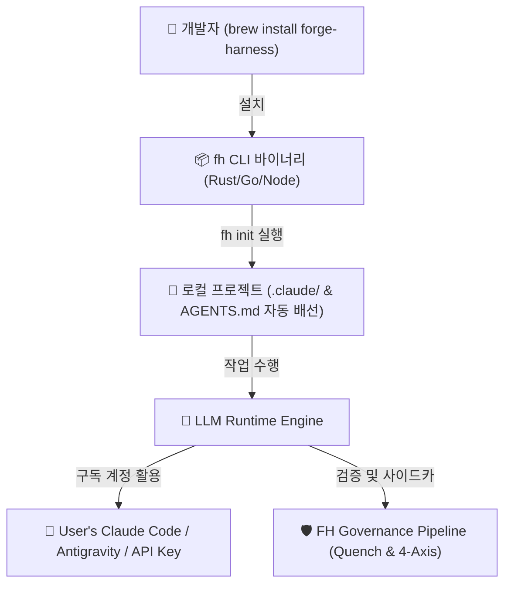

# forge-harness 글로벌 입지 분석 및 배포 로드맵 (Global Positioning & Distribution Roadmap)

## Executive Summary

본 보고서는 **`forge-harness` (FH)의 글로벌 에이전트 프레임워크 생태계 내 포지셔닝**을 객관적으로 정의하고, **유료 구독 모델(Claude Code / Antigravity 등) 기반 환경에서 독립 바이너리/패키지 매니저(`brew install`) 배포 모델로의 확장 가능성 및 로드맵**을 제시합니다.

* **글로벌 포지셔닝**: FH는 코드를 직접 빠르게 뱉어내는 '실행 에이전트'가 아닌, 실행 결과의 환각·보안·근거를 적대적으로 검증하고 자가 진화하는 **품질 거버넌스 계층(Governance Brain)**입니다. (외부 벤치마크나 경쟁사 대비 정량 비교는 아직 없음 — 이 문서의 비교표는 포지셔닝 프레임이지 검증된 성능 우위 주장이 아님.)
* **배포 모델 결론**: **구독 모델 기반 LLM(Claude Code, Antigravity)과 `brew install` / 독립 바이너리 배포는 대립하지 않으며 완벽히 호환됩니다.** CLI 설치 프로그램(`fh-cli`)이 환경 감지, 플러그인 동기화, 사이드카 라우팅, Git 훅 배선을 자율 수행하고 실제 에이전트 추론은 사용자의 기존 구독/API 계정을 활용합니다.

---

## 1. 글로벌 생태계 구조 비교 (Governance Brain vs. Bare Coders)

```
[ Bare Execution Coders ]               [ forge-harness (Governance Brain) ]
 (OpenCode, Devin, Aider 등)              (자가 진화, Quench, 4-Axis Gate)
┌───────────────────────────┐           ┌───────────────────────────────────┐
│ • 고속 코드 생성           │  +  +  +  │ • 적대적 4축 검증 (Steel-Quench)  │
│ • CLI / 데스크톱 패키징   │  =======> │ • 출처 역추적 (Phantom-Quench)    │
│ • 빌드 / 테스트 자동 실행  │  Synergy  │ • 필드 패턴 자가 수확 (Harvest)   │
└───────────────────────────┘           └───────────────────────────────────┘
```

> **읽는 법**: 아래 표는 FH의 자체 포지셔닝 프레임이지, OpenCode/Devin/Aider를 벤치마크·정량 비교한 결과가 아닙니다. 그 도구들도 각자 검증/자동화 기능을 주장하므로, "단순 고속생성기"로 단순화한 왼쪽 열은 균형 잡힌 비교가 아니라 FH 관점의 상대적 강조점으로 읽어야 합니다.

| 검증 및 배포 축 | "실행 우선" 코딩 에이전트 부류 (OpenCode / Aider 등, FH 관점 프레이밍) | forge-harness (FH Meta-Harness) |
|---|---|---|
| **주요 역할** | 코드 및 스크립트 고속 자동 생성 | 생성물 품질 검증, 자가 진화, 거버넌스 |
| **품질 검증** | 단위 테스트(CI) 통과 여부만 확인 (도구별 상이 — 미검증 일반화) | **CI가 놓치는 엣지케이스/보안/근거 적대적 검수** |
| **학습 메커니즘** | 단순 대화 이력 수동 보존 (도구별 상이 — 미검증 일반화) | **세션 마감 시 `harvest-loop`로 자가 규율 업데이트** |
| **현재 배포 형태**| `brew install`, 단일 바이너리, GUI 앱 | npm 패키지 [`@chrono-meta/fh-gate`](https://www.npmjs.com/package/@chrono-meta/fh-gate) (v1.4.x) & 레포지토리 |

---

## 2. 라이브 npm 패키지 (`@chrono-meta/fh-gate`)의 실제 실체와 전수 출하 범위

### 2.1. npm 패키지의 실제 포함 범위 (152개 `files[]` 전수 실측)
`forge-harness` npm 패키지(`@chrono-meta/fh-gate` v1.4.x, 누적 17,000+ 다운로드)는 단순한 "경량 단품 검사기"가 아니라, **하네스의 모든 방법론, 스킬, 에이전트, 독트린 지식베이스를 100% 담고 있는 포터블 이식 패키지**입니다.

* **실제 번들 포함 자산 (`package.json` `files[]` 152개 전수)**:
  1. **스킬 & 에이전트 전체**: `plugins/fh-meta/skills·agents`, `plugins/fh-commons/skills·agents` (29개+ 스킬 및 8개 에이전트 전원 포함)
  2. **핵심 독트린 지식베이스 전체**: `knowledge/shared/harness-core/` (§7 Standpoint 축, `field_verdict_crossfamily_gate.md`, `sonnet_floor_doctrine.md` 등), `knowledge/shared/dialogue/`, `knowledge/shared/rules/`
  3. **`CLAUDE.md` & `AGENTS.md` 자체**: Standpoint 트리거 행을 포함한 하네스 규칙 정본
  4. **4축 게이트 기계층 전체**: `pre-commit`/`pre-push` 훅, `selfcheck`, `package-coverage`, `branch_claim`, `consent_registry`, `public_surface_scan` 스크립트 전수
* **제외 항목 (단 3가지)**:
  * `tracks/` (개별 허브의 세션/작업 이력 — 개인화된 운영 데이터)
  * `knowledge/domain/` (조직 특화 도메인 지식)
  * `paper/` (arXiv 제출용 논문 원고)

### 2.2. npm 배포와 로컬 워크스페이스 간의 관계
* **npm (`@chrono-meta/fh-gate`)**: 키노트 및 학술 논문(arXiv)의 핵심 검증 방법론(§7 Standpoint 축 포함), 스킬, 에이전트, 게이트를 어느 레포에서나 `npx` 한 줄로 100% 실행할 수 있게 제공하는 **완전체 포터블 하네스 패키지**.
* **로컬 워크스페이스 (Local Hub)**: npm으로 배포되는 스킬/에이전트/독트린 정본 위에 **해당 허브 고유의 이월 작업 이력(`tracks/`)**이 지속해서 쌓여 자가진화하는 **운영 허브(Operating Hub)**.

### 2.3. Homebrew (`brew install`)와의 차세대 확장 관계
* npm 패키지가 Node.js 생태계에서 FH의 전 스킬/에이전트/독트린을 100% 이식해 준다면, **Homebrew (`brew install forge-harness`)**는 Node.js 종속성 없이 OS 레벨에서 글로벌 CLI 바이너리 및 전역 Git 훅 셋업을 지원하는 **글로벌 OS 패키지 채널 확장(Phase 2)** 역할을 수행합니다.

---

## 3. 구독 모델 기반 런타임과 CLI 브리지 배포의 호환 원리

### 3.1. 구조적 작동 원리 (CLI Bridge Architecture)

`brew install`이나 독립 `.exe/.app` 바이너리는 **"LLM 모델 자체를 내장하는 것"이 아니라, "에이전트가 작동하는 로컬 하네스 인프라를 자동으로 구축·관리해 주는 CLI 도구(Launcher/Bridge)"**를 설치하는 것입니다.



1. **설치 단계 (`brew install forge-harness`)**:
   * 경량 바이너리(`fh` CLI)가 사용자의 Mac/Linux에 설치됩니다.
2. **프로젝트 연동 (`fh init` 또는 `fh setup`)**:
   * 명령 한 줄로 프로젝트에 최신 `AGENTS.md`, `plugins/`, `rules/`, Git 훅을 자동으로 구성하고 종속성을 진단합니다.
3. **추론 실행 시**:
   * `fh` CLI는 코드를 직접 추론하는 대신, 사용자가 이미 구독 중인 **Claude Code, Antigravity CLI, 또는 로컬 API 키**를 브리지(Bridge)하여 오케스트레이션을 수행합니다.

---

## 4. forge-harness 진화 로드맵 (Evolution Roadmap)

```
[ Phase 1: 로컬 메타 하네스 코어 ] ──> [ Phase 2: npm 완전체 배포 ] ──> [ Phase 3: Homebrew & IDE 에코시스템 ]
 (자가진화 본체 & 지식 완비)           (누적 17,000+ 다운로드, 현재!)       (OS 전역 CLI & cmux/IDE 연동)
```

### Phase 1: 로컬 파일 시스템 메타 하네스 코어 (완료)
* **특징**: `AGENTS.md`, `plugins/`, Markdown 기반의 모델 비의존성 프로세스 및 검증 지능 완비.
* **달성**: `steel-quench`, `phantom-quench`, `sim-conductor`, `ko-tech-writer` 등 29개+ 스킬 및 8개 에이전트 개발 완료.

### Phase 2: npm 공식 레지스트리 포터블 완전체 배포 (현재 완벽히 라이브)
* **특징**: npm 공식 패키지 [`@chrono-meta/fh-gate`](https://www.npmjs.com/package/@chrono-meta/fh-gate) (v1.4.x)를 통해 152개 번들 파일 전수 출하.
* **달성 (누적 17,000+ 다운로드)**:
  * 29개+ 스킬 전체, 8개 에이전트 전원, §7 Standpoint 축 포함 지식베이스, 4축 게이트 엔진이 타르볼에 100% 실려 배포되어 어느 레포에서나 `npx`로 100% 실행 가능함.
  * `fh-gate`, `fh-run`, `fh-goal`, `fh-codex-doctor` CLI 실행 가능.

### Phase 3: Homebrew OS 패키지 채널 확장 & IDE/Event-Bus 에코시스템 (차기 목표)
* **특징**: Node.js 환경 의존성이 없는 OS 전역 CLI 라운처(`brew install forge-harness`) 및 IDE/플러그인 직접 연동.
* **목표**:
  * `brew install forge-harness`
  * `fh setup`: 명령 한 줄로 신규 레포지토리에 하네스 구조(`.claude/`·`plugins/`·rules·Git 훅)를 스캐폴딩
  * OpenCode, Hermes, VS Code, JetBrains, `cmux` 플러그인과 직접 Event-bus 연동.
* **⚠️ 스캐폴딩 ≠ 복리(compounding)** — `meta-harness-thin-vs-full-distribution.md`(2026-06-08, 이미 결론난 축)의 핵심: FH의 진짜 값어치는 스킬/명령 자체가 아니라 **클론 상태에 쌓이는 `tracks/`·메모리·규칙 이력(오케스트레이션)**에 있음. `fh setup`이 구조를 1초 만에 깔아줘도, 그 프로젝트가 실제 FH급 시너지를 가지려면 이후 세션이 쌓이며 `tracks/`가 축적돼야 함 — 초기화 시점의 "완전 배포"와 축적된 자가진화 상태는 다른 것. 로드맵을 실행할 때는 이 구분을 각주가 아니라 Phase 3의 성공 기준에 포함시킬 것.
* **⚠️ 신규 바이너리 필요성 미검토** — 위 mermaid 다이어그램은 `fh CLI 바이너리 (Rust/Go/Node)`로 언어를 미정으로 남겨두고 있음. 이미 라이브인 Node 기반 npm CLI(`bin/fh-gate.js` 등)를 감싸는 Homebrew formula(`brew install node && npm i -g @chrono-meta/fh-gate`를 formula가 대행)로 같은 목표를 훨씬 싸게 달성할 수 있는지부터 검토 후, 그걸로 부족한 이유가 명확할 때만 신규 언어/바이너리 재작성으로 넘어갈 것 (Added-Scope Gate: "이거 없이 안 되는 게 뭔가?"에 먼저 답하기).

---

## 5. 결론

1. **글로벌 입지**: `forge-harness`는 단순 코드 생성을 넘어선 **품질 거버넌스 및 자가진화 계층**입니다 (외부 벤치마크 비교는 미실시 — §1 캡션 참조).
2. **배포 메커니즘**: 구독 모델(Claude Code 등)을 사용하더라도 `brew install`을 통해 **로컬 하네스 인프라 구축, 자동 업데이트, 환경 통합을 수행하는 CLI 라운처** 형태로 확장할 수 있습니다 — 단, 그 라운처가 주는 것은 초기 스캐폴딩이며 FH의 복리(compounding) 자체는 아님(§4 Phase 3 각주).

---
*Documented by Antigravity in forge-harness Knowledge Core (`knowledge/shared/harness-core/fh_global_positioning_and_distribution_roadmap.md`). Reviewed and source-grounded 2026-08-15.*
