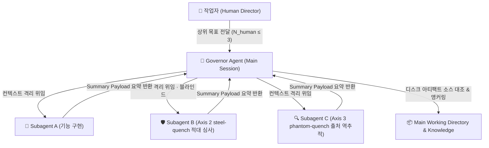

# 하네스와 터미널 간 상관관계 및 사용 추천 (Correlation & Recommendation Report)

## Executive Summary

본 분석 보고서는 **AI 에이전트 하네스(Agent Harness)의 발달 수준과 터미널 환경(Multiplexer / Sandbox) 간의 상관관계 및 직교적 계층 구조**를 규명하고, 신뢰성 기반의 최적 운용 모델을 제안합니다.

* **핵심 명제**: **"신뢰된 로컬 개발 환경에서는, 터미널 인프라에 의존하지 않는 얇은 하네스(Thin Harness)로 충분하다."** (전칭 «가장 뛰어난» 을 뺐다 — 비교 모집단을 잰 적이 없다)
* **결론**: 에이전트 자체의 오케스트레이션 및 자가 검증(**4축 게이트** — Axis 1 `regression_guard.sh` · Axis 2 `steel-quench` · Axis 3 `phantom-quench` · Axis 4 `edit-manifest`, FH 자산 변경 시 **커밋 경계에서 훅으로 강제**)이 성숙한 환경에서는 터미널 멀티플렉서(`cmux`)를 **가벼운 UI 껍데기**로 활용하고 **거버너(Governor) 에이전트 위임 모델**을 적용하는 것이 인지 부하를 최소화합니다. 단, 비신뢰 코드 실행 및 파괴적 부작용이 수반되는 과제는 **위험도 기반 샌드박싱(Risk-Driven Sandboxing)**에 따라 **실제 커널 경계를 가진 샌드박스**(Firecracker · Kata · gVisor · Docker Sandboxes 계열)를 하부에 계층화하여 방어합니다. 🟥 초판은 이 자리에 `Orca` 를 적었고 그것은 틀렸다(§4 최종추천 2 · §명명된 잔여 1).

---

## 1. 문제 제기 및 백그라운드

과거 AI 에이전트 운용 초기에는 에이전트의 오탐, 환각, 호스트 파일시스템 오염을 막기 위해 **외부 인프라(터미널 멀티플렉서, 무거운 Docker/VM 샌드박스)**로 에이전트를 감싸고 통제했습니다.

그러나 메타 하네스(`forge-harness`) 체계가 도입되면서, 에이전트 스스로 하위 작업을 생성·위임하고, 검증(4축 게이트)과 마감 피어 동기화(`knowledge/shared/rules/multi_session_close_protocol.md` — **마감 순서와 peer 델타 append 규율**이지, 메모리 색인 락이 아니다)를 소프트웨어적 통제 레이어에서 수행할 수 있게 되었습니다.

이에 따라 **개발자 UX를 위한 UI 레이어(`cmux`)**, **거버넌스·오케스트레이션 레이어(`FH`)**, 그리고 **OS/커널 보안 레이어**의 역할 분담 및 선택 기준을 규정할 필요성이 제기되었습니다. 🟥 **초판은 세 번째 자리에 `Orca` 를 놓았으나 Orca 는 보안 레이어가 아니다** — Stably AI 의 멀티에이전트 오케스트레이터 데스크톱 앱이고 격리 기전이 **git worktree** 라, `cmux`·`FH` 와 **같은 층의 경쟁재**다.

---

## 2. 3계층 구조 대조 분석 (UI · 거버넌스 · 보안실행)

터미널 및 하네스 수단은 선형 대체 관계가 아닌 **3계층 구조**입니다. 🟥 **단 «직교»는 과장이다** — 아래 표가 보여주듯 UI 층(cmux)과 프로토콜 층(FH)은 **worktree 격리에서 겹친다**. 초판은 «cmux 격리 = 없음»을 전제로 직교를 주장했고 그 전제가 틀렸다(임포트 심사에서 외부 1차 문서로 반증). 실제 구분선은 *격리를 제공하느냐*가 아니라 **검증 게이트를 강제하느냐**다:

```
┌─────────────────────────────────────────────────────────┐
│ 1. Presentation / UI Layer (e.g. cmux)                  │ ──> 인간의 시각적 탭/세션 관리를 위한 껍데기
├─────────────────────────────────────────────────────────┤
│ 2. Protocol / Governance Layer (e.g. forge-harness)   │ ──> 지능적 오케스트레이션, 검증 게이트, 소스 앵커링
├─────────────────────────────────────────────────────────┤
│ 3. Execution / Security Sandbox Layer                    │ ──> OS/커널 레벨의 보안, 자원 쿼터, 파괴 방지
│    (Firecracker · Kata · gVisor · Docker Sandboxes)      │     ⚠️ 이 층에 Orca·cmux 는 해당하지 않는다
└─────────────────────────────────────────────────────────┘
```

| 비교 축 | Execution Sandbox (Firecracker · gVisor · Docker Sandboxes) | UI/오케스트레이터 (`cmux` · `Orca`) | Protocol-Native Harness (FH 거버너 위임) |
|---|---|---|---|
| **계층 역할** | OS/커널 레벨의 물리적 보안 및 자원 격리 | 시각적 탭/창 관리를 위한 UI 껍데기 | 지능적 오케스트레이션 및 소스 앵커링 |
| **격리 범위** | 파일시스템, 네트워크 포트, 커널, CPU/RAM 쿼터 | 🟥 **«없음» 이 아니다** — cmux 는 local / **worktree** / SSH 워크스페이스를 자체 제공한다고 공식 페이지가 밝힌다(<https://cmux.com/>, 2026-08-16 열람). ⚠️ 이는 **벤더 서술이며 격리 강도를 실측한 것이 아니다** | 서브에이전트 컨텍스트 격리 (별도 컨텍스트 윈도우·요약 반환). **worktree 는 FH 의 기본 격리 수단이 아니다** |
| **주요 장점** | 비신뢰 코드 실행 시 호스트 시스템 보호(완전 격리는 아니다 — MicroVM 탈출 사례가 실존한다) | 낮은 인지 오버헤드, 빠른 로컬 파일 접근 | 편향 격리(저자 추론을 못 본 채 평가), 컨텍스트 보존, 검증 게이트 |
| **주요 단점** | 기동 오버헤드, 피어 감지 및 볼륨 바인딩 마찰 | 자원 경합 및 직접적인 호스트 부작용 무방비 | 에이전트의 거버넌스 능력 필요. 🟥 **worktree 를 쓰면 게이트가 깨진다** (아래 §3.2 주의) |
| **선택 기준** | **비신뢰 코드, 패키지 설치, 파괴적 셸 실행** | **신뢰된 로컬 환경 (1~3개 상위 세션)** | **모든 에이전트 오케스트레이션 및 검증** |

---

## 3. 구조적 상관관계 메커니즘

### 3.1. 인간 활성 인지 한계 ($N_{human} \le 3$) vs 서브에이전트 비동기 병렬성 ($M_{subagent}$)
보고서의 세션 제한 규율은 **인간의 동기식 의사결정 맥락**과 **서브에이전트 백그라운드 병렬성**으로 명확히 구별됩니다.

1. **인간 활성 세션 ($N_{human} \le 3$)**:
   * 개발자가 직접 개입하고 의사결정을 내리는 동기식 스트림을 **최대 3개**로 제한합니다. 🟥 **이 «3»은 운영자의 운용 규율이지 문헌값이 아니다** — 초판은 Miller's Law 에 귀속시켰으나 Miller(1956)의 수는 **7±2 chunks**(단기기억 span), 4±1 은 Cowan(2001)이고 **어느 쪽도 3을 주지 않는다.** 권위 이름을 뗀 채로 둔다(근거 = 운영 경험, 표본 미측정).
     * **Stream 1**: 메인 도메인 기능 개발 (Feature Track)
     * **Stream 2**: 시스템 리팩토링 및 테스트 (Refactoring Track)
     * **Stream 3**: 실험적 R&D 및 스펙 검토 (Research Track)
2. **서브에이전트 백그라운드 병렬성 ($M_{subagent}$)**:
   * 거버너 에이전트 하위에서 백그라운드로 작동하는 비동기 서브에이전트는 인간 인지 부하를 **크게 늘리지 않으므로** $M > 3$ 병렬 실행이 가능하다고 **가정**합니다. ⚠️ **미측정 운용 가설이다** — «인지 부하 0» 도 «자원·rate limit 에 의해서**만** 제한» 도 잰 적이 없다(거버너의 통합·검토 부담은 M 에 따라 늘어난다). 재려면 M 을 바꿔가며 거버너 턴수·정정 횟수를 세야 한다.

### 3.2. 거버너 + 위임 패턴 및 요약 페이로드 게이트 (Context Budgeting)
`forge-harness`의 기본 독트린은 **거버너(Governor) 세션이 마감 권한과 소스 재검증 권한을 독점**하고, 하위 에이전트에게 **컨텍스트 격리**(별도 컨텍스트 윈도우, 저자 추론 미상속)를 위임하는 방식입니다.

> 🟥 **worktree 로 위임하지 마라 — 이건 FH 가 실측으로 반대하는 경로다.** `CLAUDE.md §Agent Dispatch
> Operation` 이 정본이다: ⓐ 문서가 설치를 지시하는 **상대경로 `core.hooksPath`** 형태에서는
> worktree 안의 훅 사본을 고치면 그 worktree 의 게이트가 무력화된다(실측 `rc=0` — 마커 없는 FH 자산
> 커밋이 통과). ⓑ 그와 무관하게 **`tracks/` 가 gitignored 라 worktree 로 따라가지 않으므로**, Axis 2–3
> 마커와 Axis 4 매니페스트가 **구조적으로 부재**한다 — 만족시킬 수 없는 게이트는 우회를 훈련시킨다.
> ⇒ **FH 자산 커밋은 표준 세션에서 한다.** worktree 는 «자율 하위 격리»의 수단이 아니라 게이트 무결성
> 위험이며, 이 문서의 초판은 그것을 강점으로 서술했다(임포트 심사에서 정정).

단, 거버너 세션의 컨텍스트 윈도우 포화(Context Rot)를 방지하기 위해 서브에이전트는 대용량 원문 대신 **정제된 요약 페이로드(Summary Payload / Context Card)** 형태로 거버너에게 보고하며, 거버너는 앵커링 시에만 해당 디스크 아티팩트를 원문 대조합니다.



### 3.3. 세션 간 메모리 동기화 (Peer Dialog Protocol의 범위)
병렬 세션 간 마감 충돌은 `multi_session_close_protocol.md` 의 **마감 순서 규율 + peer 델타 append(자기 소유 파일에만 쓴다)**로 다룹니다. 🟥 **다만 이것을 «메모리 색인 쓰기 충돌의 완화책»으로 읽으면 안 된다** — 그 프로토콜에는 메모리 색인 락도 트랜잭션 락도 **없다**. 그리고 그 문서 자신이 명시하는 한계가 이 문서의 cmux 권고를 직접 약화시킨다: **peer 판별이 cwd 매칭이라 다른 worktree 의 peer 를 못 잡는다.** 즉 세션을 늘릴수록 «살아있는 peer 에게 물어본다» 단계가 조용히 빈다. 동시 쓰기의 실제 방어선은 이 프로토콜이 아니라 **디렉터리/파일 소유 분리**이며, 락은 현재 존재하지 않는 미구축 항목이다.

---

## 4. 위험도 기반 샌드박싱 의사결정 트리 (Risk-Driven Decision Tree)

```
                       [ 새로운 작업 오더 ]
                                │
                 Is Execution Dangerous / Untrusted?
                 (비신뢰 코드, 외부 패키지, 파괴적 셸)
                                │
                   ┌────────────┴────────────┐
                  YES                        NO
                   │                         │
      [ 커널 샌드박스 ]             [ Meta-Harness (FH) / Thin Protocol + cmux ]
      (OS/커널 물리 격리 적용)       (표준 세션 + 거버너 오케스트레이션)
                                             │
                                    Human Decision Streams?
                                             │
                                   ┌─────────┴─────────┐
                             N_human <= 3        N_human > 3
                                   │                   │
                            [ cmux 1~3개 탭 ]  [ 인지 과부하 경고: ]
                            (가벼운 UI 껍데기)   [ 과제 통합 및 조정 ]
```

### 최종 요약 추천
1. **신뢰된 로컬 환경 (Trusted Local Setup)**: **`Meta-Harness (forge-harness) + cmux` (가벼운 UI 껍데기 1~3개 탭)**
   * 메타 하네스가 자가 검증(4축 게이트)과 거버너 오케스트레이션, 서브에이전트 **컨텍스트 격리**를 수행하므로, 인프라 오버헤드가 없는 `cmux` 를 **잠정 권고**합니다(이 운영자 구성에서의 판단, n=1 · cmux 미실측). 여기서 "Thin Harness"는 인프라 샌드박스 대비 소프트웨어 프로토콜 중심이라는 최소 기준을 의미하며, `forge-harness`는 이 계층의 최상위 메타 하네스로 작동합니다.
   * ⚠️ **범위 한정**: `cmux` 는 **macOS 전용 네이티브 앱**이다. FH 지식본은 크로스플랫폼이므로 이 권고는 macOS 노드에만 적용되며, 리눅스/윈도우 노드의 UI 층 선택은 이 문서가 다루지 않는다(미조사).
2. **비신뢰 및 파괴적 과제 (Untrusted Execution)**: **실제 커널/하이퍼바이저 샌드박스** — Firecracker · Kata Containers · gVisor · Docker Sandboxes 계열
   * 파괴적 셸 명령, 비신뢰 외부 코드 실행 시에는 커널 경계를 가진 샌드박스를 하부에 배치해 호스트 노출을 크게 줄입니다(«완벽»이 아니다 — 커널/하이퍼바이저 탈출은 실존하는 위협 클래스다).
   * 🟥 **초판은 여기에 `Orca` 를 «물리 샌드박스»로 적었고 그건 틀렸다. 이 정정이 이 문서에서 가장
     중요하다** — `stablyai/orca` 는 *"The AI Orchestrator for 100x builders"* 로, 격리 기전이
     **git worktree** 다(*"each in its own isolated git worktree"*). 커널 격리도 MicroVM 도 컨테이너도
     **없다.** 초판의 권고를 그대로 따르면 **비신뢰 코드를 커널 샌드박스로 착각한 채 호스트에서 그냥
     실행하게 된다.** worktree 는 «어느 파일을 보느냐»의 분리이지 «무엇을 실행할 수 있느냐»의 경계가
     아니다 — 같은 커널·같은 사용자 권한·같은 네트워크다.

---

## 5. FH 는 Orca 를 이미 써 보고 떠났다 (2026-07-12 기록)

이 문서가 놓친 가장 큰 맥락은 **FH 가 Orca 를 실제로 운용해 본 이력이 있다**는 것이다.
따라서 «Orca vs cmux» 는 가설 비교가 아니라 **이미 내려진 결정의 사후 서술**이다.

> 🟥 **출처 도달성 — 이 절의 표는 리뷰어가 검증할 수 없다.** 근거는 운영자 memory
> `reference_orca_app_config.md`(2026-07-12) · `feedback_no_ui_terminal_native_identity.md` 인데,
> **둘 다 이 레포에 없다**(비공개 컴패니언 스토어의 gitignored 기록). 즉 아래 표는
> `LOCAL-ONLY ATTESTATION — UNVERIFIED` 이며, 저자의 주장이지 리뷰어가 확인한 증거가 아니다.
> 이것은 `fh_4axis_gate.md §Reviewer-visible evidence` 가 지적하는 «증거를 리뷰어가 닿을 수 없는
> 곳에 둔» 바로 그 형태다 — 라벨은 갭을 정직하게 드러낼 뿐 닫지 않는다. **cross-family 심사가
> 지목해서 추가된 문단이다**(내부 세션은 자기 memory 가 보이니 이 결손이 안 보였다).

| 관찰(2026-07-12 실측) | 함의 |
|---|---|
| Orca 는 작업마다 `~/orca/workspaces/<레포>/<브랜치>/` 에 워크트리를 판다 | FH 자산 커밋 경로와 정면 충돌 — §3.2 의 게이트 무결성 문제를 **구조적으로 상시 유발** |
| 그 결과 세 레포에 **방치 브랜치 다수** 발생, 스윕으로 정리 | 병렬성의 정리 비용이 사람에게 남는다 |
| 에이전트별 기본 인자에 `--dangerously-skip-permissions` 가 박혀 있었다 | 승인 게이트를 기본값으로 우회 — FH 의 HITL 규율과 반대 방향 |
| 상태 훅이 **프롬프트 원문·툴콜까지** 로컬 상태파일에 기록 (실측 확인 후 OFF) | 텔레메트리 표면. residency 관점에서 점검 대상 |

**운영자 결론(그대로 인용)**: FH 는 *"사람=선형적 단일스레드로 거버넌스, AI=병렬 사이드카가
흩어졌다 다시 모여 결과만 보고"* 하는 구조인데, Orca 는 반대로 *"병렬성을 사람이 보는 표면에
그대로 노출"* 시켜 **통합 부담을 사람에게 떠넘긴다.**

⇒ 이것이 cmux 로 옮긴 실제 이유이며, §3.1 의 $N_{human} \le 3$ 과 같은 축이다: **UI 층은 병렬성을
보여주기만 해야 하고, 병렬성을 관리하는 주체는 거버너여야 한다.**

⚠️ **단 이것은 도구의 속성이 아니라 «어떻게 쓰느냐»의 문제다** — cmux 도 팀/에이전트 오케스트레이션
기능을 갖고 있다(공식 페이지). 여기서 «가벼운 UI 껍데기»는 **그 기능을 쓰지 않고 탭 관리로만 쓰는
운용 구성**을 가리키며, 그렇게 쓰는 한 통합 부담이 거버너에 남는다. 같은 도구를 오케스트레이터로
쓰기 시작하면 Orca 에서 떠난 이유가 **cmux 에서도 그대로 재발한다.** (초판 정정문은 이를 cmux 의
속성인 것처럼 썼고, cross-family 심사가 그 과장을 지목했다.)

---

## 명명된 잔여 (Named Residuals)

이 문서는 **다른 런타임(Antigravity/Gemini 계열)이 2026-08-15 에 작성한 것을 2026-08-16 에 FH 로
임포트하면서 4축 게이트로 심사한 판본**이다. 초판의 주장 중 반증된 것은 위 본문에 🟥 로 표시했다.
남은 잔여는 다음과 같다 — 닫힌 척하지 않는다.

1. ✅ **`Orca` 오귀속 — 해소됨(운영자 지목 + 실물 확인). 이 문서 최대의 정정이다.**
   초판은 Orca 를 «OS/커널 MicroVM 물리 샌드박스»로 세웠다. 실물은
   [`stablyai/orca`](https://github.com/stablyai/orca) — *"The AI Orchestrator for 100x builders"*,
   *"each in its own isolated **git worktree**"* 다. 커널 격리도 MicroVM 도 컨테이너도 **없다.**
   ⇒ Orca 는 보안층이 아니라 **`cmux`·FH 와 같은 층의 오케스트레이터**다.
   위험도는 분류 오류에 그치지 않는다: 초판을 그대로 따르면 **비신뢰 코드를 커널 샌드박스로 착각한
   채 호스트 권한으로 실행하게 된다.**
2. **cmux 는 로컬 미설치 — 벤더 1차 문서 대조까지만 했고 런타임 실측이 아니다.** 워크스페이스 격리
   제공 사실은 공식 문서 기반이며, 그 격리의 *강도*는 재지 않았다.
3. **`N_human ≤ 3` 은 표본 미측정 운용 규율**이다(§3.1). 문헌 근거 없음이 확인된 상태이지,
   3이 옳다고 검증된 것이 아니다.
4. **메모리 색인 동시쓰기 방어는 미구축**이다(§3.3). 하네스 층 파일 락은 존재하지 않으며,
   현재 방어선은 파일 소유 분리라는 *규율*뿐이다.
5. **부록의 심사 이력은 저자 런타임 자기신고**이며 재현 불가하다(아래 부록 자체 주석 참조).
6. **표본 n=1** — 단일 운영자·단일 머신 구성에서의 판단이다.

---

## Appendix: `ko-tech-writer` & 글로벌 전문가 심사 이력 (Audit Log)

| 파이프라인 단계 | 수행 항목 및 결과 | 비고 / check-class |
|---|---|---|
| **Step 0 레지스터** | 독자용 아키텍처 기술문서 (문어 존댓말/명료체) | mandatory-pass |
| **Step 1 캘리브레이션** | FH Knowledge Core 정본 표본(`knowledge/shared/harness-core/fh_ecosystem_positioning.md`) 서식 및 톤 대조 완료 | mandatory-pass |
| **Step 2 문체 규율** | 번역투·조각문 5종 스캔 «잔여 0건 (양성 컨트롤 동반)» 주장 | 🟥 `UNCALIBRATED` — 컨트롤이 무엇이었는지·재현 커맨드·출력이 **하나도 없다**. 재현 불가한 0은 0의 증거가 아니다 |
| **Step 3 정직 수위** | 저자 내부 집계 규율 서술 제거 및 독자 의사결정 기반 정보 보존 | judged |
| **Step 4 수치·주장 게이트** | 수치 전수 추출 + «전칭 단정 스캔 잔여 0건» 주장 | 🟥 `UNCALIBRATED — 자기반증`: 그 «0건» 시점에 본문에 전칭 단정이 **3건 살아 있었다**(«완벽 보호» ×2, «가장 뛰어난 하네스») — 임포트 심사가 손으로 잡아 정정했다. 계기는 초록인데 대상을 안 쟀다 |
| **Step 5 지각 QA** | Mermaid 다이어그램 노드 레이블 및 Decision Tree ASCII 렌더링 시각 확인 완료 | judged |
| **글로벌 인프라 심사** | 논리 격리 vs 보안 샌드박싱 분리, 자원 경합 및 Context Budgeting 피드백 반영 | 🟥 `LOCAL-ONLY ATTESTATION — UNVERIFIED`: 저자 런타임(Antigravity) 측 심사이고, 짝으로 적혀 있던 `research` 서브에이전트는 **이 레포에 존재하지 않는다**(등록 에이전트 8종 중 없음). FH 안에서 재현 불가 |
| **적대적 공격 심사** | 직교적 3계층 모델 재정립, $N_{human}$ vs $M_{subagent}$ 인지 분리, 샌드박싱 조건 개고 | 🟥 `LOCAL-ONLY ATTESTATION — UNVERIFIED`: `challenger` 는 실재하는 FH 에이전트지만(`plugins/fh-meta/agents/challenger.md`), 이 행이 가리키는 실행의 마커·로그가 없다. **이름의 실재는 실행의 증거가 아니다** |

> 🟥 **이 부록 전체의 지위**: 저자 런타임의 **자기신고**이며, 위 «잔여 0건»·«PASS» 는 아티팩트로
> 뒷받침되지 않는다. FH 자기 규율상 이것은 증거가 아니라 저자의 주장이다
> (`fh_4axis_gate.md §Reviewer-visible evidence` 의 degrade 라벨을 그대로 적용).
> **이 문서에 대한 재현 가능한 심사는 임포트 시점의 4축 게이트 기록**이며, 그 델타는
> 부록이 아니라 커밋 이력과 `tracks/_meta/edit_manifest.yaml` 2026-08-16 항목에 있다.

---
*Authored by an Antigravity (Gemini-family) runtime, 2026-08-15; imported into the FH Knowledge Core and reviewed under the 4-axis gate on 2026-08-16.*
